# First Project Phase: HTX Exchange Interface & CSV Data Loader

## Overview

This design document outlines the first phase of the project, focusing on preparing the interface and configuring API requests for the HTX exchange, along with debugging and enhancing the CSV loader from the exchange. The system is built on a multi-agent architecture where specialized agents handle specific functionality domains.

The current implementation provides a solid foundation with HTX API integration, CSV processing capabilities, and a secure agent-based server architecture. The first phase aims to refine these components and establish a robust data pipeline for cryptocurrency trading data.

## Architecture

### System Architecture Overview

The project follows a modular agent-based architecture with clear separation of concerns:

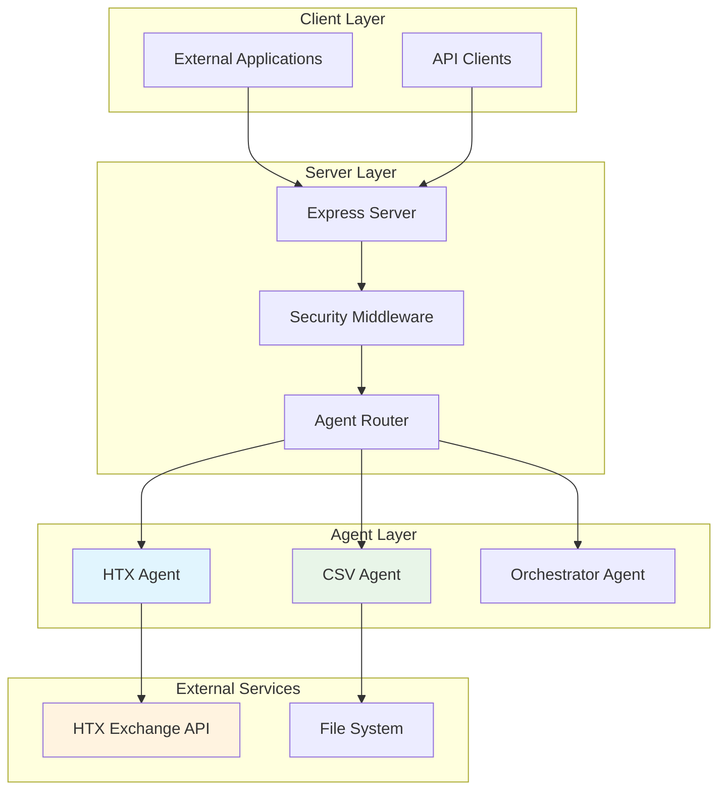

### Component Responsibilities

| Component | Primary Function | Key Responsibilities |
|-----------|------------------|---------------------|
| Express Server | HTTP API Gateway | Request routing, middleware coordination, response formatting |
| Security Middleware | Protection Layer | Rate limiting, input sanitization, header security |
| HTX Agent | Exchange Integration | Market data retrieval, API authentication, candle data processing |
| CSV Agent | Data Processing | File parsing, data transformation, validation, export |
| Orchestrator Agent | Workflow Coordination | Multi-agent task orchestration, report generation |

## HTX Exchange Interface Design

### Authentication & Security Architecture

The HTX interface implements a secure credential management system using Fernet encryption:

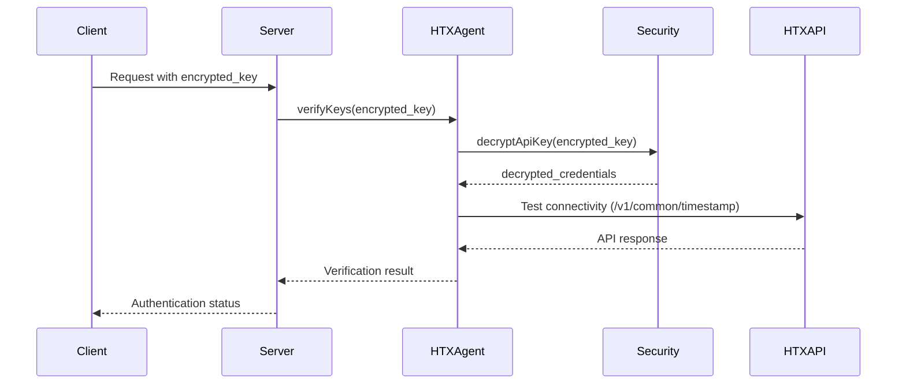

### API Endpoint Specifications

| Endpoint | Purpose | Input Parameters | Response Format |
|----------|---------|------------------|-----------------|
| `/agent/htx/verifyKeys` | Credential validation | `encrypted_key: string` | `{ok: boolean, message: string, keyValid: boolean}` |
| `/agent/htx/fetchMarkets` | Market data retrieval | `limit?: number` | `{markets: MarketData[], count: number}` |
| `/agent/htx/fetchCandles` | Historical OHLCV data | `symbol: string, interval: string, limit: number` | `{candles: CandleData[], symbol: string, count: number}` |
| `/agent/htx/parseExcel` | Trading report parsing | `filePath: string, reportType: string` | `{summary: ReportSummary}` |

### Market Data Structure

The HTX agent provides standardized market data format combining symbol information with real-time ticker data:

| Field | Type | Description | Source Endpoint |
|-------|------|-------------|----------------|
| symbol | string | Trading pair identifier | /v1/common/symbols |
| baseCurrency | string | Base asset symbol | /v1/common/symbols |
| quoteCurrency | string | Quote asset symbol | /v1/common/symbols |
| price | number | Current market price | /market/tickers |
| volume | number | 24h trading volume | /market/tickers |
| change | number | 24h price change percentage | Calculated from ticker data |

### Candlestick Data Processing

Historical price data follows a standardized time-series format for analytical processing:

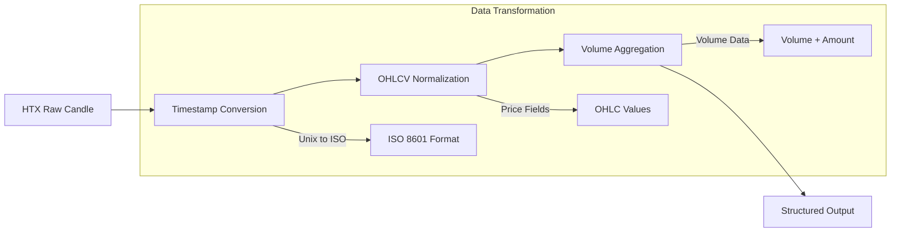

## CSV Data Loader Architecture

### File Processing Pipeline

The CSV agent implements a comprehensive data processing pipeline with multiple stages:

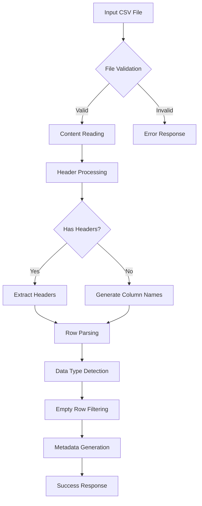

### Data Transformation Capabilities

The CSV agent supports multiple transformation operations for financial data processing:

| Operation | Purpose | Parameters | Use Case |
|-----------|---------|------------|----------|
| Filter | Row-based filtering | `condition: string` | Remove invalid trading records |
| Map | Column value mapping | `column: string, value: string` | Calculate derived metrics |
| Aggregate | Statistical operations | `column: string` | Generate trading summaries |
| Sort | Data ordering | `column: string, order: string` | Time-series organization |

### Validation Schema Design

Data validation ensures data quality and consistency across the processing pipeline:

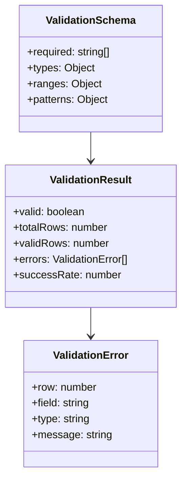

## Interface Integration Patterns

### Agent Communication Protocol

The system uses a standardized communication pattern between agents and the server:

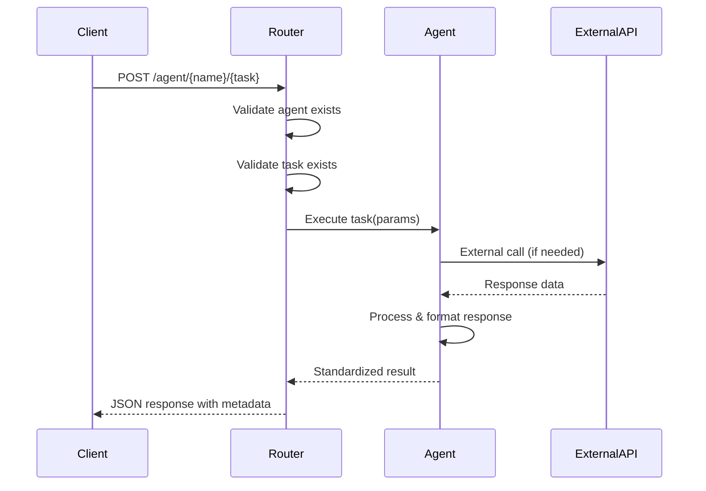

### Error Handling Strategy

The system implements consistent error handling across all components:

| Error Type | Response Pattern | Recovery Action |
|------------|------------------|-----------------|
| Authentication | `{ok: false, error: "auth_failed"}` | Re-encrypt credentials |
| Network | `{error: "network_timeout", retry: true}` | Exponential backoff |
| Data Format | `{error: "invalid_format", details: [...]}` | Fallback parsing |
| File Access | `{error: "file_not_found", path: "..."}` | Path validation |

## Data Flow Architecture

### End-to-End Processing Workflow

The complete data flow from HTX exchange to processed CSV output:

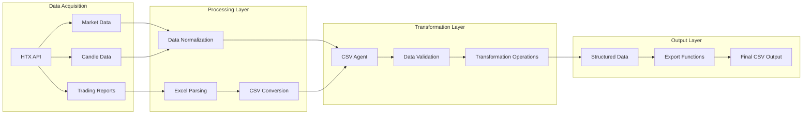

### State Management

The system maintains state through structured data objects rather than persistent storage:

| Component | State Type | Lifecycle | Purpose |
|-----------|------------|-----------|---------|
| HTX Agent | Connection Status | Per-request | API connectivity tracking |
| CSV Agent | Processing Context | Per-operation | Transformation state |
| Server | Agent Registry | Application | Available agent mapping |

## Testing Strategy

### Unit Testing Framework

Each agent includes comprehensive unit testing for core functionality:

| Test Category | Coverage Target | Test Framework | Example Tests |
|---------------|----------------|----------------|---------------|
| API Integration | HTX Agent methods | Jest | `verifyKeys()`, `fetchMarkets()` |
| Data Processing | CSV Agent functions | Jest | `parseCSV()`, `transformData()` |
| Security | Encryption/Decryption | Jest | Fernet key handling |
| Server Routing | Express endpoints | Supertest | Agent routing validation |

### Integration Testing Approach

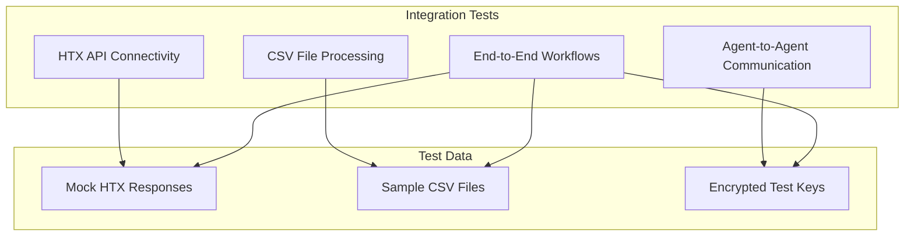

## Performance Optimization Strategy

### HTX API Rate Limiting

The HTX exchange implements rate limiting that must be respected to maintain stable connectivity:

| Endpoint Category | Rate Limit | Strategy | Implementation |
|------------------|------------|----------|----------------|
| Public Market Data | 100 req/10s | Request queuing | Built-in Express rate limiter |
| Private Account Data | 10 req/1s | Token bucket | Custom middleware |
| Historical Data | 20 req/1min | Batch processing | Chunked requests |

### Memory Management for Large CSV Files

CSV processing optimization for exchange data files:

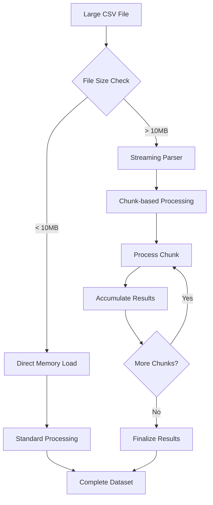

### Caching Strategy

Implement intelligent caching for frequently requested market data:

| Data Type | Cache Duration | Invalidation Trigger | Storage Method |
|-----------|----------------|---------------------|----------------|
| Market Symbols | 24 hours | Manual refresh | In-memory Map |
| Recent Candles | 5 minutes | New data arrival | LRU Cache |
| Exchange Status | 1 minute | Health check failure | Redis (optional) |

## Security Hardening

### API Key Management

Enhanced security measures for HTX API credentials:

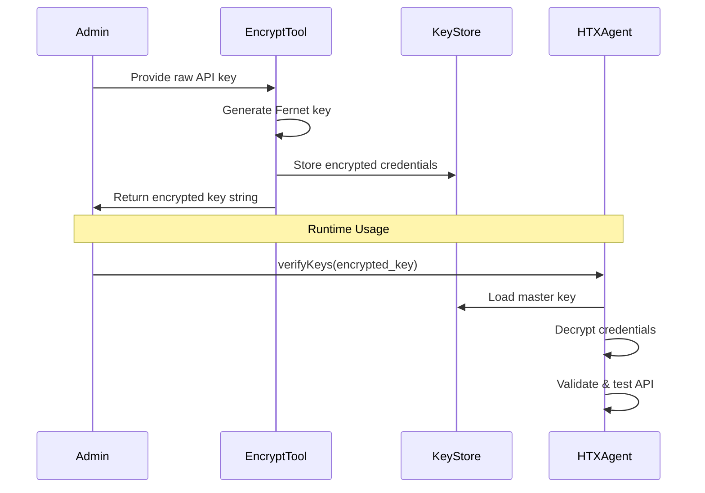

### Input Validation Framework

Comprehensive validation rules for all agent inputs:

| Parameter Type | Validation Rules | Error Response | Security Benefit |
|----------------|------------------|----------------|------------------|
| File Paths | Whitelist directories, no traversal | Path validation error | Prevents directory traversal |
| API Parameters | Type checking, range limits | Invalid parameter error | Prevents injection attacks |
| CSV Content | Size limits, encoding validation | Content validation error | Prevents malicious file upload |
| Encrypted Keys | Format validation, length check | Encryption error | Prevents key manipulation |

## Configuration Management

### Environment-Based Configuration

Flexible configuration system supporting multiple deployment environments:

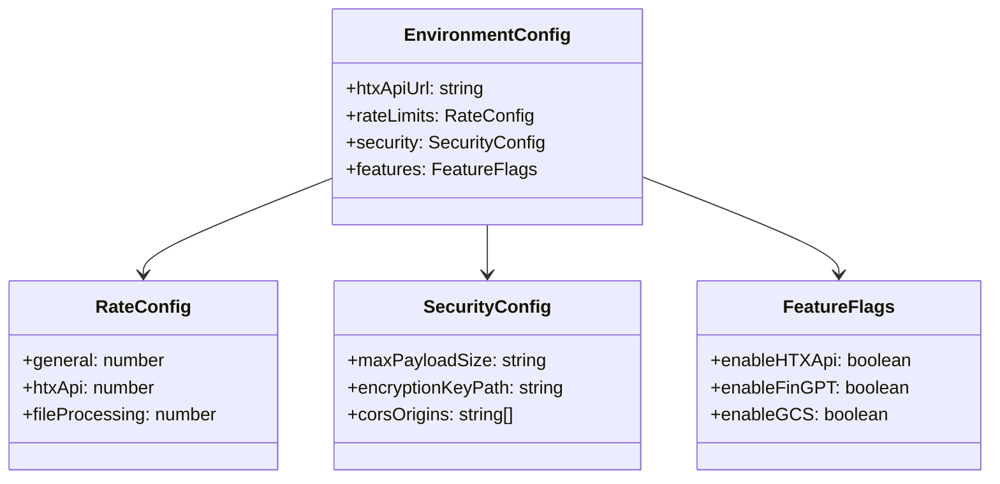

### Feature Flag Implementation

Dynamic feature control for gradual rollout:

| Feature | Default State | Override Method | Impact |
|---------|---------------|-----------------|--------|
| HTX_API | enabled | ENV var | Market data availability |
| CSV_VALIDATION | enabled | Runtime config | Data quality checks |
| RATE_LIMITING | enabled | Security config | API protection |
| DEBUG_LOGGING | disabled | Development flag | Detailed error info |

## Monitoring & Observability

### Health Check Architecture

Comprehensive system health monitoring:

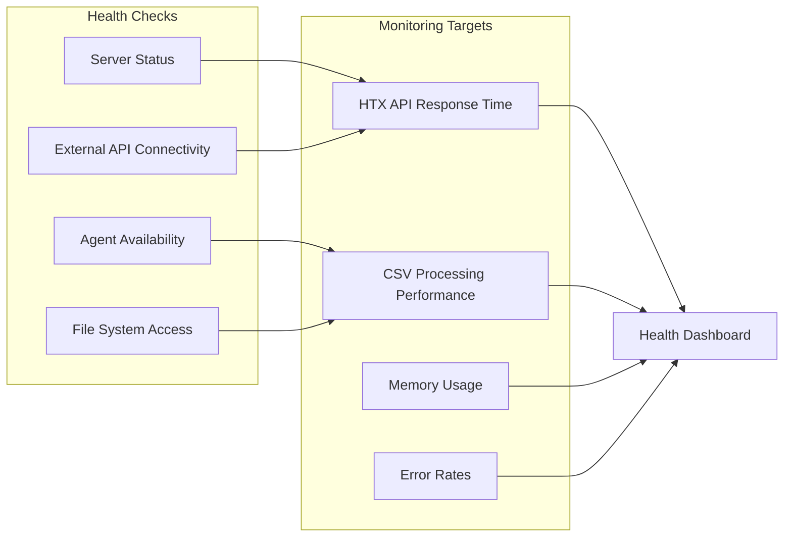

### Error Tracking & Alerting

Structured error classification for effective debugging:

| Error Category | Severity Level | Alert Threshold | Recovery Action |
|----------------|----------------|-----------------|----------------|
| API Timeout | Warning | > 5 in 1 minute | Retry with backoff |
| Authentication Failure | Critical | > 1 in 5 minutes | Manual intervention |
| CSV Parse Error | Info | > 10 in 1 hour | Log analysis |
| System Resource | Critical | Memory > 90% | Process restart |

## Deployment Architecture

### Container Configuration

Docker-based deployment with proper resource allocation:

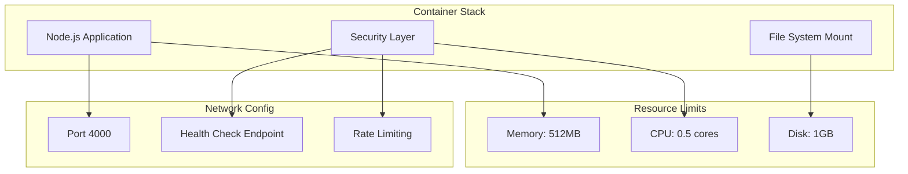

### Scaling Considerations

Horizontal scaling strategy for increased load:

| Component | Scaling Method | Bottleneck | Solution |
|-----------|----------------|------------|----------|
| HTX Agent | Load balancing | API rate limits | Request queuing |
| CSV Agent | Process isolation | Memory usage | File streaming |
| Server | Multiple instances | Shared state | Stateless design |

## Development Workflow

### Phase Implementation Roadmap

```mermaid
gantt
    title First Phase Implementation Timeline
    dateFormat X
    axisFormat %d
    
    section HTX Interface
    API Authentication    :1, 3
    Market Data Endpoints :2, 5
    Error Handling       :4, 7
    Rate Limiting        :6, 8
    
    section CSV Loader
    Basic Parsing        :1, 4
    Validation System    :3, 6
    Transformation Logic :5, 8
    Performance Optimization :7, 10
    
    section Integration
    Component Testing    :6, 9
    End-to-End Testing   :8, 11
    Documentation        :9, 12
    Deployment Prep      :10, 12
```

### Quality Gates

Mandatory checkpoints before phase completion:

| Checkpoint | Criteria | Validation Method | Success Metric |
|------------|----------|-------------------|----------------|
| HTX Connectivity | API authentication works | Automated test | 100% success rate |
| Data Processing | CSV parsing handles edge cases | Unit tests | > 95% test coverage |
| Performance | Response time acceptable | Load testing | < 2s response time |
| Security | Encryption/validation active | Security scan | Zero critical issues |

## Troubleshooting Guide

### Common Issues & Solutions

| Issue Category | Symptom | Diagnostic Steps | Resolution |
|----------------|---------|------------------|------------|
| HTX API Errors | 403/401 responses | Check encrypted key format | Re-encrypt API credentials |
| CSV Parse Failures | Empty result sets | Validate file encoding | Convert to UTF-8 |
| Performance Issues | Slow response times | Monitor memory usage | Implement streaming |
| Connection Timeouts | Network errors | Check API endpoints | Implement retry logic |

### Debug Information Collection

Structured approach to gathering diagnostic data:

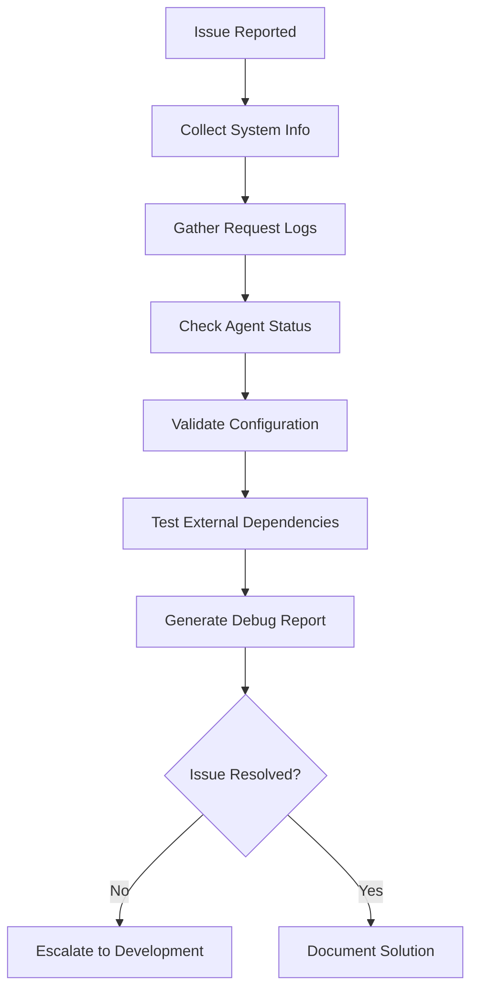

## API Contract Specifications

### HTX Agent API Contracts

Detailed request/response specifications for all HTX agent endpoints:

#### verifyKeys Endpoint
```
POST /agent/htx/verifyKeys
Content-Type: application/json

Request Schema:
{
  "encrypted_key": "string (required) - Fernet-encrypted HTX API key"
}

Response Schema:
{
  "ok": "boolean - Operation success status",
  "message": "string - Human-readable status message",
  "timestamp": "number - HTX server timestamp",
  "keyValid": "boolean - API key validation result",
  "error": "string (optional) - Error description if failed"
}
```

#### fetchMarkets Endpoint
```
POST /agent/htx/fetchMarkets
Content-Type: application/json

Request Schema:
{
  "limit": "number (optional) - Maximum markets to return (default: 100)",
  "filter": "string (optional) - Currency filter (e.g., 'usdt', 'btc')"
}

Response Schema:
{
  "markets": [
    {
      "symbol": "string - Trading pair symbol",
      "baseCurrency": "string - Base asset",
      "quoteCurrency": "string - Quote asset", 
      "state": "string - Trading state",
      "price": "number - Current price",
      "volume": "number - 24h volume",
      "high": "number - 24h high",
      "low": "number - 24h low",
      "change": "number - 24h change percentage"
    }
  ],
  "metadata": {
    "totalRows": "number - Total markets returned",
    "columns": "number - Data columns count"
  },
  "error": "string (optional) - Error if operation failed"
}
```

### CSV Agent API Contracts

#### parseCSV Endpoint
```
POST /agent/csv/parseCSV
Content-Type: application/json

Request Schema:
{
  "filePath": "string (required) - Absolute path to CSV file",
  "delimiter": "string (optional) - Field delimiter (default: ',')",
  "hasHeader": "boolean (optional) - File has header row (default: true)",
  "encoding": "string (optional) - File encoding (default: 'utf8')"
}

Response Schema:
{
  "success": "boolean - Parse operation success",
  "filePath": "string - Processed file path",
  "headers": "string[] - Column headers",
  "data": "object[] - Parsed row objects",
  "metadata": {
    "totalRows": "number - Rows processed",
    "columns": "number - Column count",
    "delimiter": "string - Used delimiter",
    "hasHeader": "boolean - Header presence",
    "encoding": "string - File encoding",
    "fileSize": "number - File size in bytes"
  },
  "error": "string (optional) - Error description"
}
```

## Data Model Specifications

### HTX Market Data Model

Standardized data structure for market information:

| Field | Data Type | Constraints | Description | Example |
|-------|-----------|-------------|-------------|---------|
| symbol | string | 6-10 chars, alphanumeric | Trading pair identifier | "btcusdt" |
| baseCurrency | string | 2-8 chars, uppercase | Base asset symbol | "BTC" |
| quoteCurrency | string | 2-8 chars, uppercase | Quote asset symbol | "USDT" |
| state | string | enum: online/offline/suspend | Trading status | "online" |
| price | number | > 0, up to 8 decimals | Current market price | 45123.45 |
| volume | number | >= 0, up to 8 decimals | 24h trading volume | 1234.56789 |
| high | number | > 0, up to 8 decimals | 24h highest price | 45500.00 |
| low | number | > 0, up to 8 decimals | 24h lowest price | 44800.00 |
| change | number | -100 to +∞, up to 4 decimals | 24h change percentage | 2.1567 |

### Candlestick Data Model

Time-series format for historical price data:

| Field | Data Type | Constraints | Description | Example |
|-------|-----------|-------------|-------------|---------|
| timestamp | string | ISO 8601 format | Candle open time | "2024-01-15T10:00:00.000Z" |
| open | number | > 0, up to 8 decimals | Opening price | 45000.12345678 |
| high | number | > 0, up to 8 decimals | Highest price in period | 45123.87654321 |
| low | number | > 0, up to 8 decimals | Lowest price in period | 44987.11111111 |
| close | number | > 0, up to 8 decimals | Closing price | 45067.55555555 |
| volume | number | >= 0, up to 8 decimals | Trading volume | 123.45678901 |
| amount | number | >= 0, up to 8 decimals | Trading amount in quote currency | 5567890.12345678 |

### CSV Processing Data Model

Flexible schema for CSV data handling:

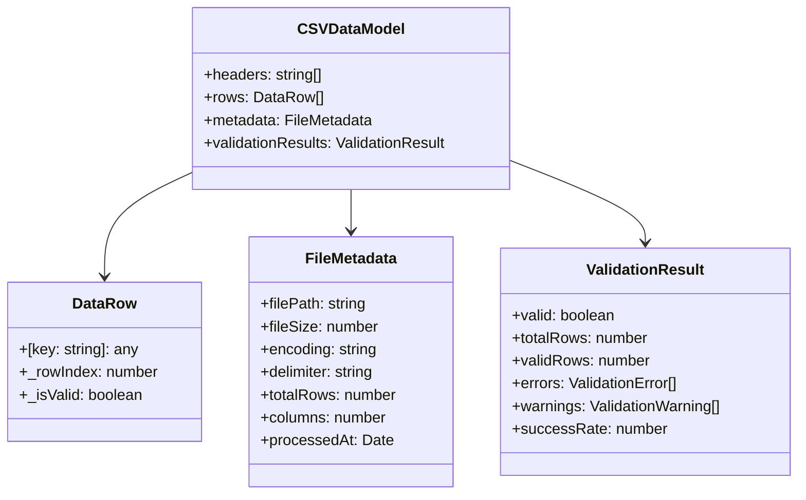

## Error Handling Specifications

### Standardized Error Response Format

Consistent error structure across all agents:

```json
{
  "success": false,
  "error": {
    "code": "ERROR_CODE",
    "message": "Human-readable error description",
    "details": {
      "field": "specific field that caused error",
      "value": "invalid value",
      "expected": "expected value format"
    },
    "timestamp": "2024-01-15T10:30:00.000Z",
    "requestId": "uuid-for-tracking"
  }
}
```

### Error Classification System

| Error Category | HTTP Status | Error Codes | Recovery Strategy |
|----------------|-------------|-------------|-------------------|
| Validation | 400 | VAL_001-VAL_999 | Fix input parameters |
| Authentication | 401 | AUTH_001-AUTH_999 | Re-encrypt credentials |
| Authorization | 403 | AUTHZ_001-AUTHZ_999 | Check API permissions |
| Not Found | 404 | NF_001-NF_999 | Verify resource exists |
| Rate Limiting | 429 | RATE_001-RATE_999 | Implement exponential backoff |
| External API | 502 | EXT_001-EXT_999 | Retry with circuit breaker |
| Internal Error | 500 | INT_001-INT_999 | Log and investigate |

## State Management Architecture

### Agent State Lifecycle

State management pattern for agent operations:

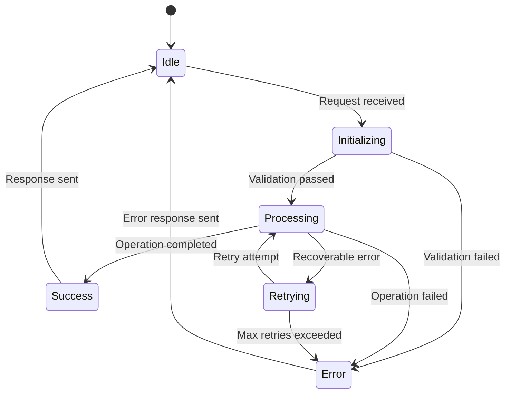

### Memory Management Strategy

Resource allocation and cleanup patterns:

| Resource Type | Allocation Strategy | Cleanup Trigger | Max Lifetime |
|---------------|-------------------|-----------------|-------------|
| HTTP Connections | Connection pooling | Request completion | 30 seconds |
| File Handles | On-demand opening | Processing completion | 5 seconds |
| Memory Buffers | Lazy allocation | GC triggers | Request scope |
| Cache Entries | LRU eviction | Size/time limits | 5 minutes |

## Integration Patterns

### Qoder Quest Mode Integration

Seamless integration with Qoder's AI-assisted development workflow:

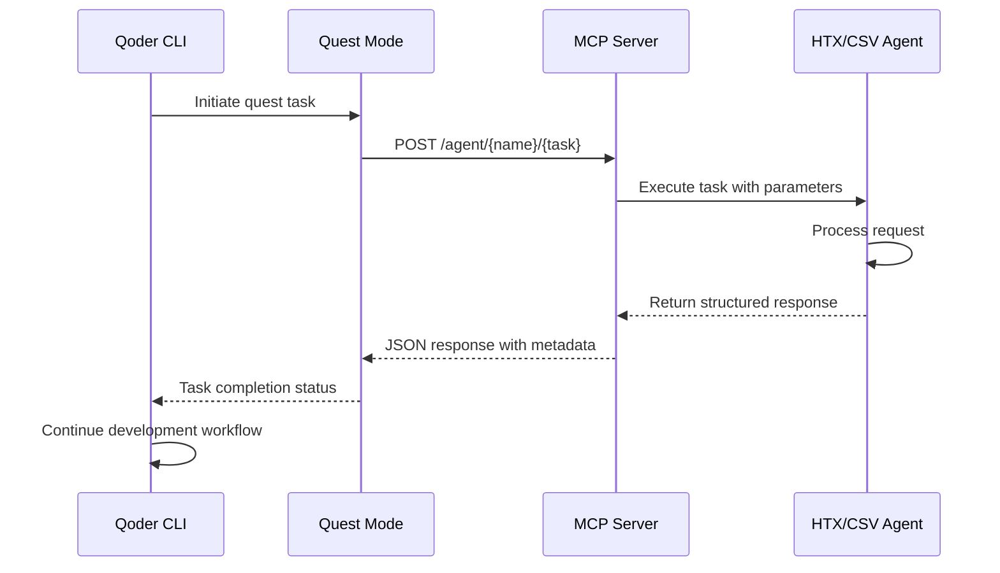

### GitHub Copilot Agent Integration

Compatibility with GitHub Copilot's coding agent capabilities:

| Integration Point | Copilot Feature | MCP Server Response | Usage Pattern |
|------------------|-----------------|---------------------|---------------|
| Code Completion | Context awareness | Structured data models | Type-safe development |
| Error Analysis | Error explanation | Detailed error objects | Debugging assistance |
| API Discovery | Endpoint suggestions | OpenAPI-compatible schemas | API exploration |
| Testing Support | Test generation | Mock data responses | Unit test creation |

## Extensibility Framework

### Agent Plugin Architecture

Framework for adding new agents to the system:

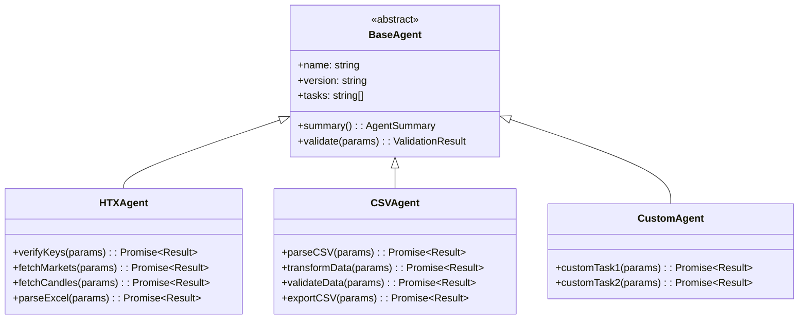

### Configuration Schema Extension

Standardized configuration format for new agents:

```json
{
  "agents": [
    {
      "name": "customAgent",
      "version": "1.0.0",
      "tasks": ["customTask1", "customTask2"],
      "entry": "src/agents/customAgent.js",
      "config": {
        "rateLimit": 100,
        "timeout": 30000,
        "retries": 3
      },
      "dependencies": ["htxAgent", "csvAgent"],
      "features": {
        "caching": true,
        "validation": true,
        "monitoring": true
      }
    }
  ]
}
```