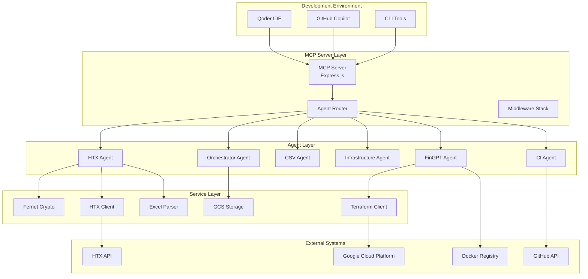
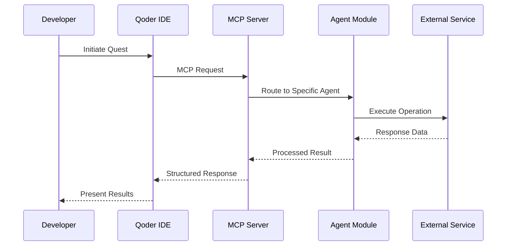
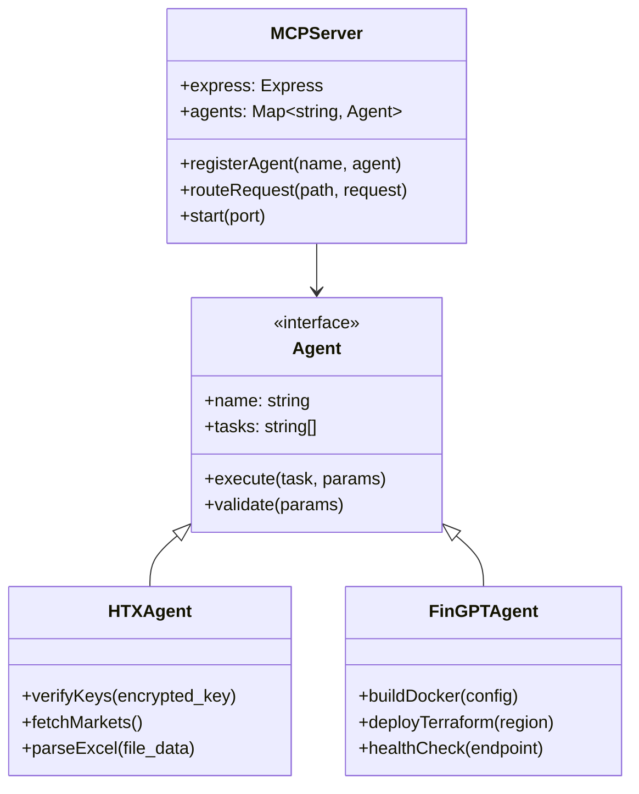
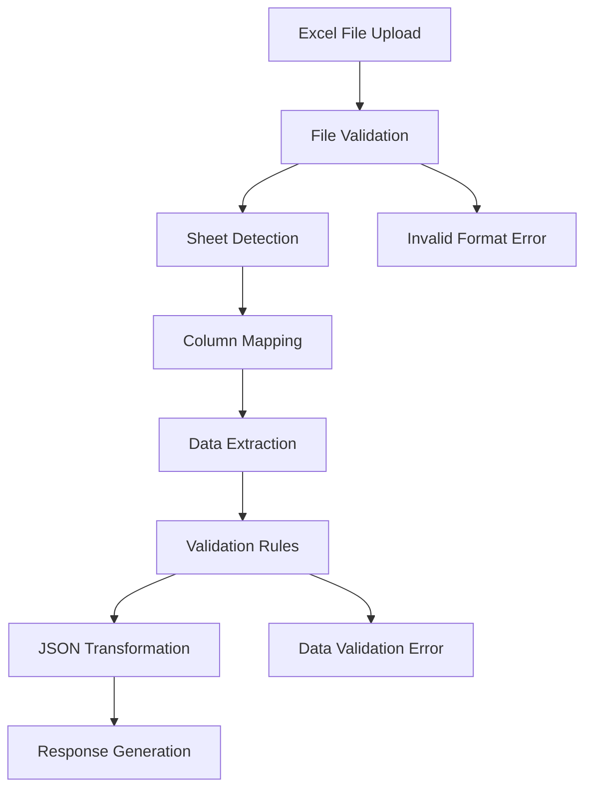
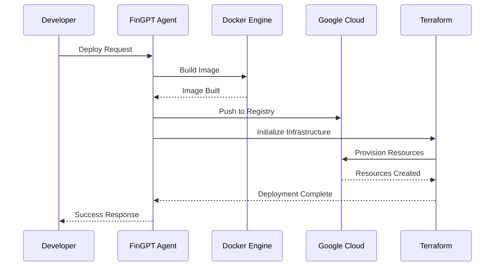
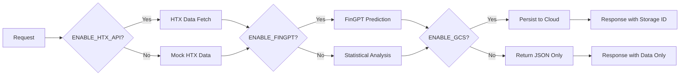
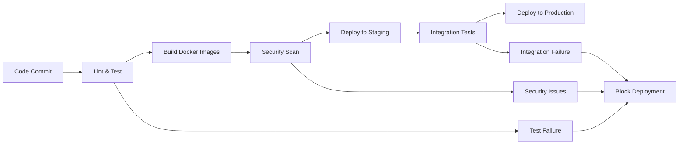

# MCP Server Setup and Development Workflow Design

## Overview

The MCP (Model Context Protocol) Server is a Node.js-based integration platform that serves as a bridge between AI development tools (Qoder IDE, GitHub Copilot) and specialized financial analytics services. The system implements a modular agent-based architecture to support HTX cryptocurrency analytics, FinGPT model deployment, and infrastructure automation workflows.

The server provides standardized REST endpoints for AI agents to interact with financial data sources, deploy machine learning models, and manage cloud infrastructure through a unified interface. This design enables seamless integration with development environments while maintaining secure handling of sensitive financial data and API credentials.

## Architecture

### System Components

The architecture follows a layered approach with clear separation of concerns:



### Agent Architecture Pattern

Each agent implements a standardized interface for task execution and maintains specific domain expertise:

| Agent | Responsibilities | External Dependencies |
|-------|-----------------|---------------------|
| HTX Agent | API key verification, market data retrieval, Excel report parsing | HTX API, Fernet encryption |
| FinGPT Agent | Docker image management, Terraform deployment, health monitoring | Docker, Terraform, GCP |
| CSV Agent | Data parsing, transformation, validation | Local file system |
| Infrastructure Agent | Terraform operations, GCP resource management | Terraform CLI, GCP APIs |
| CI Agent | Test generation, code linting, GitHub integration | Jest, ESLint, GitHub API |
| Orchestrator Agent | End-to-end pipeline coordination, reporting | All other agents, GCS |

### Communication Flow



## MCP Server Core Implementation

### Server Infrastructure

The Express.js server provides a lightweight, extensible foundation with the following characteristics:

**Port Configuration**: Default port 4000 with environment variable override capability
**Request Processing**: JSON body parsing with error handling middleware
**Health Monitoring**: Built-in health check endpoint for service monitoring
**Agent Routing**: Dynamic routing to agent modules based on request patterns

### Core Endpoints

| Endpoint | Method | Purpose | Response Format |
|----------|--------|---------|----------------|
| `/health` | GET | Service health verification | `{ ok: boolean }` |
| `/tests` | POST | Test stub generation | `{ tests: string }` |
| `/billing` | GET | GitHub Copilot billing status | GitHub API passthrough |
| `/lint` | POST | Code quality validation | `{ lint: string, details: string }` |

### Agent Integration Pattern

Agents are dynamically loaded and registered with the server using a standardized interface:



## HTX Interface Implementation

### Security Architecture

The HTX interface implements a multi-layered security approach:

**Encryption Layer**: Fernet symmetric encryption for API key storage
**Validation Layer**: API key verification before operational use
**Access Control**: Read-only operations to minimize security exposure
**Error Handling**: Sanitized error responses to prevent information leakage

### API Endpoints Design

| Endpoint | Purpose | Request Format | Response Format |
|----------|---------|---------------|----------------|
| `POST /htx/keys/test` | Decrypt and validate API credentials | `{ encrypted_key: string }` | `{ ok: boolean, error?: string }` |
| `GET /htx/markets` | Retrieve market symbols and tickers | Query parameters | `{ markets: MarketData[] }` |
| `GET /htx/candles` | Historical OHLCV data retrieval | `{ symbol, interval, limit }` | `{ candles: CandleData[] }` |
| `POST /htx/report/upload` | Excel report parsing | Multipart form data | `{ summary: ReportSummary }` |

### Data Models

**Market Data Structure**:
- Symbol identifier (string)
- Base and quote currencies (string)
- Current price and volume (decimal)
- 24-hour statistics (object)

**Candle Data Structure**:
- Timestamp (ISO 8601)
- OHLCV values (decimal)
- Volume indicators (decimal)

**Report Summary Structure**:
- Trade records count (integer)
- Total volume and fees (decimal)
- Date range coverage (date objects)
- Error records (array)

### Excel Parser Implementation

The Excel parser handles multiple HTX export formats:

**Trade Reports**: Transaction history with timestamps, symbols, quantities, and fees
**Balance Reports**: Account balance snapshots with asset allocations
**Deposit/Withdrawal Reports**: Fund movement tracking with transaction IDs



## FinGPT Deployment Architecture

### Containerization Strategy

The FinGPT deployment implements a multi-stage Docker approach:

**Base Stage**: Python runtime with ML dependencies
**Model Stage**: FinGPT model artifacts and configuration
**Service Stage**: REST API endpoint with health monitoring
**Production Stage**: Optimized runtime with security hardening

### Container Services

| Service | Purpose | Ports | Dependencies |
|---------|---------|-------|-------------|
| fingpt-api | ML model inference | 8080 | Python 3.9, TensorFlow |
| mcp-server | Integration layer | 4000 | Node.js 18, Express |
| nginx-proxy | Load balancing | 80, 443 | SSL certificates |

### Terraform Infrastructure

**Google Cloud Platform Resources**:
- Artifact Registry for container images
- Cloud Run for serverless deployment
- IAM service accounts with minimal permissions
- Cloud Storage for model artifacts
- Cloud Monitoring for observability

**Resource Naming Convention**:
- Project prefix: `last-hope`
- Environment suffix: `dev`, `staging`, `prod`
- Resource type identifier in name

### Deployment Pipeline



## Integration Layer Design

### Service Integration Matrix

| Integration | HTX Analytics | FinGPT Deployment | GCS Storage | Feature Flag |
|-------------|---------------|-------------------|-------------|--------------|
| Standalone HTX | ✓ | ✗ | Optional | `ENABLE_HTX_API` |
| Standalone FinGPT | ✗ | ✓ | Optional | `ENABLE_FINGPT` |
| Full Analytics | ✓ | ✓ | ✓ | All enabled |
| Development Mode | Mock data | Local Docker | MinIO | `DEV_MODE` |

### Analytics Endpoints

**Summary Endpoint** (`/analytics/summary`):
- Aggregates HTX market data
- Invokes FinGPT prediction service
- Combines results into insights JSON
- Optionally persists to cloud storage

**Report Retrieval** (`/analytics/report/:id`):
- Fetches stored analysis reports
- Supports pagination for large datasets
- Implements caching for frequently accessed reports
- Provides metadata about report generation

### Feature Flag Implementation



### Error Handling Strategy

**Circuit Breaker Pattern**: Prevents cascading failures between services
**Graceful Degradation**: Returns partial results when components are unavailable
**Retry Logic**: Exponential backoff for transient failures
**Monitoring Integration**: Structured logging for observability

## Development Workflow

### Qoder IDE Integration

**Quest Mode Configuration**:
- Import quest specifications from `.qoder/quest/` directory
- Automatic agent task routing based on quest requirements
- Real-time feedback loop with MCP server
- Integration with version control workflows

**MCP Server Registration**:
```json
{
  "mcpServers": {
    "last-hope": {
      "command": "node",
      "args": ["server.js"],
      "cwd": "."
    }
  }
}
```

### Development Scripts

| Script | Purpose | Dependencies | Usage Context |
|--------|---------|-------------|---------------|
| `npm start` | Production server launch | Node.js runtime | Production deployment |
| `npm run dev` | Development with hot reload | Nodemon | Local development |
| `npm test` | Unit and integration testing | Jest framework | CI/CD pipeline |
| `npm run compose:up` | Local service orchestration | Docker Compose | Integration testing |
| `npm run tf:plan` | Infrastructure planning | Terraform CLI | Infrastructure changes |
| `npm run encrypt:key` | Security key generation | Python Fernet | Initial setup |

### Testing Strategy

**Unit Testing**:
- Agent module isolation
- Service layer validation
- Error condition coverage
- Mock external dependencies

**Integration Testing**:
- End-to-end workflow validation
- External API interaction testing
- Docker container orchestration
- Terraform infrastructure validation

**Security Testing**:
- API key encryption/decryption cycles
- Input validation and sanitization
- Error message information leakage
- Authentication and authorization flows

### Git Workflow Integration

```mermaid
gitgraph
    commit id: "Initial Setup"
    branch feature/htx-interface
    checkout feature/htx-interface
    commit id: "HTX Agent Implementation"
    commit id: "Excel Parser Addition"
    checkout main
    merge feature/htx-interface
    branch feature/fingpt-deploy
    checkout feature/fingpt-deploy
    commit id: "Docker Configuration"
    commit id: "Terraform Infrastructure"
    checkout main
    merge feature/fingpt-deploy
    branch feature/integration
    checkout feature/integration
    commit id: "Analytics Endpoints"
    commit id: "Feature Flag Implementation"
    checkout main
    merge feature/integration
```

## Security Considerations

### Credential Management

**Fernet Encryption**: Symmetric encryption for API keys and sensitive configuration
**Environment Variables**: Runtime configuration without code exposure
**Secret Rotation**: Automated credential lifecycle management
**Access Control**: Principle of least privilege for service accounts

### Network Security

**HTTPS Enforcement**: TLS encryption for all external communications
**API Rate Limiting**: Protection against abuse and resource exhaustion
**Input Validation**: Comprehensive sanitization of user-provided data
**CORS Configuration**: Restricted cross-origin access policies

### Infrastructure Security

**Container Security**: Minimal base images with security scanning
**Network Segmentation**: Isolated environments for different deployment stages
**Audit Logging**: Comprehensive activity tracking for compliance
**Backup Strategy**: Encrypted backups with retention policies

## Monitoring and Observability

### Health Monitoring

**Service Health Checks**: Automated endpoint monitoring with alerting
**Dependency Checks**: External service availability validation
**Resource Monitoring**: CPU, memory, and network utilization tracking
**Error Rate Tracking**: Real-time error frequency and categorization

### Logging Strategy

**Structured Logging**: JSON format for machine readability
**Log Levels**: Appropriate verbosity for different environments
**Sensitive Data Filtering**: Automatic PII and credential redaction
**Centralized Aggregation**: Cloud-based log management integration

### Performance Metrics

| Metric Category | Key Indicators | Alerting Thresholds |
|----------------|----------------|-------------------|
| Response Time | P95 latency < 2s | Alert if > 5s |
| Throughput | Requests per minute | Alert if < 50% baseline |
| Error Rate | HTTP 5xx percentage | Alert if > 1% |
| Resource Usage | CPU/Memory utilization | Alert if > 80% |

## Deployment Configuration

### Environment Management

**Development Environment**:
- Local Docker Compose orchestration
- Mock external services
- Hot reload for rapid iteration
- Comprehensive logging for debugging

**Staging Environment**:
- GCP Cloud Run deployment
- Real external service integration
- Performance testing environment
- Automated deployment pipeline

**Production Environment**:
- Multi-region deployment capability
- Auto-scaling configuration
- Disaster recovery procedures
- Comprehensive monitoring suite

### Infrastructure as Code

**Terraform Modules**:
- Reusable infrastructure components
- Environment-specific variable files
- State management with remote backend
- Automated plan and apply workflows

**Docker Orchestration**:
- Multi-stage build optimization
- Health check integration
- Resource limit configuration
- Security scanning integration

### Continuous Integration



The system implements automated quality gates at each stage of the